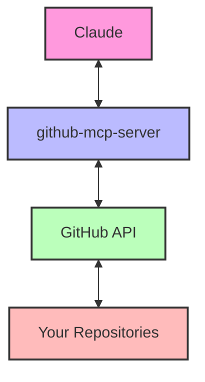

# Claude GitHub Integration 🤖 💻

<div align="center">
  


*Documentation for using Claude with GitHub via Model Context Protocol (MCP)*

</div>

## Overview

This repository documents how to use Claude with GitHub via the Model Context Protocol (MCP) server. This integration allows you to interact with GitHub repositories directly through conversations with Claude, enabling a wide range of code management, documentation, and analysis tasks.

## 🚀 Quick Start

1. Ensure you have Claude Pro subscription
2. Check that github-mcp-server is installed and configured in your Claude interface
3. Start asking Claude to perform GitHub operations

```
Claude, create a new file called example.md in my repository with the following content: 
[Your content here]
```

For more detailed setup instructions, see the [Getting Started Guide](docs/getting-started.md).

## 📋 Available Operations

| Category | Operations |
|----------|------------|
| Repository Management | Create, fork, clone repositories |
| File Operations | Read, create, update files |
| Pull Requests | Create, review, merge PRs |
| Issues | Create, update, comment on issues |
| Code Analysis | Review code, suggest improvements |

## 📚 Documentation

For detailed documentation, see the following sections:

- [Getting Started](docs/getting-started.md): Initial setup and configuration
- [Authentication](docs/authentication.md): How authentication works with github-mcp-server
- [File Operations](docs/operations/files.md): Creating, reading, and updating files

## 🚩 Templates

To help you get started, we've provided templates for common operations:

- [Create File Template](templates/prompts/create-file.md): Templates for creating new files

## 🔄 Integration Architecture



## 🔑 Authentication & Security

The github-mcp-server securely connects Claude to GitHub using your credentials. No credentials are exposed in the conversation. For more details on security considerations, see the [Authentication](docs/authentication.md) documentation.

## 🔧 Example Use Cases

- **Documentation**: Create and update READMEs, wikis, and other documentation
- **Code Management**: Create files, update code, manage repositories
- **Code Analysis**: Review code for improvements and issues
- **Issue Management**: Create and manage GitHub issues
- **Repository Setup**: Initialize new projects with standard structures

## 🤝 Contributing

Contributions are welcome! Please see [CONTRIBUTING.md](CONTRIBUTING.md) for guidelines.

## 📄 License

MIT License | Copyright (c) 2025
